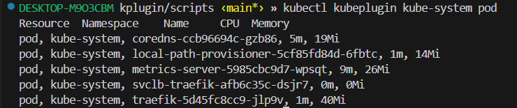

# kplugin
Plugin that retrieves and formats Kubernetes resource usage statistics

1. Download plugin

2. Make it executable
```
chmod +x kubeplugin
```
3. Install as kubectl plugin and check
```
sudo cp kubeplugin /usr/local/bin/kubectl-kubeplugin

kubectl plugin list
```


4. Usage
```
kubectl kubeplugin <namespace> <resource_type>
```

5. Usage examples:

```
kubectl kubeplugin kube-system pod
```
